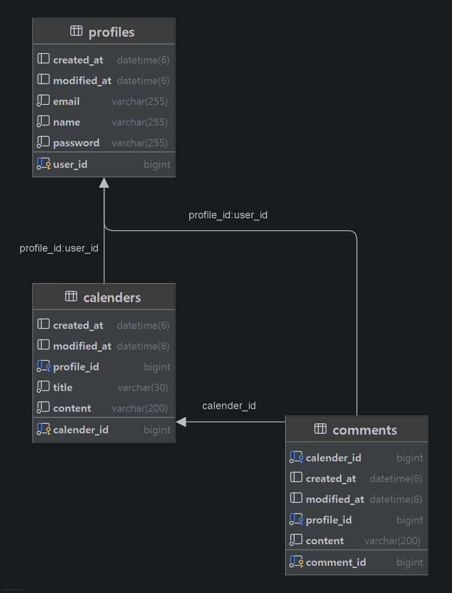

___

___

### 1. 필수과제

접기/펼치기

- [x] 일정 CRUD
    

    
접기/펼치기

    - 일정을 생성, 전체 조회, 단건 조회, 수정, 삭제할 수 있습니다.  
      - `작성 유저명`, `할일 제목`, `할일 내용`, `작성일`, `수정일` 필드  
      - `작성일`, `수정일` 필드는 `JPA Auditing`을 활용합니다.
    

- [x] 유저 CRUD
    

    
접기/펼치기

    - 유저를 생성, 전체 조회, 단건 조회, 수정, 삭제할 수 있습니다.  
    - 유저는 아래와 같은 필드를 가집니다.  
      - `유저명`, `이메일`, `작성일`, `수정일` 필드  
      - `작성일`, `수정일` 필드는 `JPA Auditing`을 활용합니다.  
    - 연관관계 구현  
      - 일정은 이제 `작성 유저명` 필드 대신 `유저 고유 식별자` 필드를 가집니다.
    

- [x] 회원가입
    

    
접기/펼치기

      
    - 유저에 비밀번호 필드 추가  
    - 8자 이상이어야함
    

- [x] 로그인
    

    
접기/펼치기
    
      
    - [ ] Cookie 활용
    - [x] Session 활용
    

### 2. 도전과제

접기/펼치기

- [ ] 다양한 예외처리
    

    
접기/펼치기

    내용
    

- [ ] 비밀번호 암호화
    

    
접기/펼치기

    내용
    

- [ ] 댓글 CRUD - 예정
    

    
접기/펼치기

    내용
    

- [ ] 일정 페이징
    

    
접기/펼치기

    내용
    

접기/펼치기

내용

